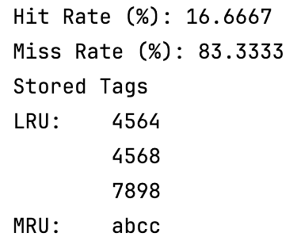

# P11_LRU_Cache
Simulate a fully-associative LRU cache



# Introduction
* Cache is an important part of the CPU. It exploits spatial and temporal locality of program and stores frequently accessed items near CPU for quick access.
* The purpose of this program is to simulate a basic cache and display the hit and miss rate.
* To understand the parameters of this cache simulation program, I recommend you to check out the reading list in the Helpful Link section. 
## Cache Parameter
* In a fully associative cache, the cache table has multiple cache blocks for a single set.
* Each cache block has a tag derived from the memory address.
* Each memory address is 16 bits (EX: 0x0000) and stores 1 byte of data.
* In this design, our cache has 1 set and holds user-decidable number of blocks, each with 4 bytes of data and is byte-addressable.
* This is an LRU cache. 
* There is no valid bit or data in the cache.
* There is only a read operation and no write operation because there's no data.

## Memory Address Translation
* Since the cache only has a set, there's no index bit.
* Since each block stores 4 bytes, the Block Offset has $log_24 = 2$ bits.
* To get the number of tag bits, subtract the Block Offset bits from the total bits and we get 14 bits.

 16 Bits Memory Address

| Tag | Index | Block Offset |
|----:|------:|-------------:|
|  14 |     0 |            2 |

### Inside the Cache
* Each of the blocks should have a valid bit, a tag, and the data.
* For simulation purposes, I ignored the valid bit and the data, leaving only the tag.

| Valid | Tag | Data |
|------:|----:|-----:|

### Acronym and Definition
* **LRU (Least Recently Used)** - a cache replacement policy when the cache is full. It replaces the least-recently used block by the new block. 
* **MRU (Most Recently Used)** - the most recently used (read or write) block in the cache.  
* **LSB (Least Significant Bit)** - the right most bit in a binary number.
* **Cache Hit** - when you read a cache, and the data stored in the memory address you want to read **is in the cache**. Since there's no data in this cache, finding the same tag in cache is a cache hit.  
* **Cache Miss** - when you read a cache, and the data stored in the memory address you want to read is **not in the cache**. The cache will then bring the data from the RAM. Here, not finding the tag is a cache miss. 

## Installation
### Linux
```
// In a directory that you want to download this project

git clone "https://github.com/ttwag/P11_LRU_Cache"

// Run the demo

cd P11_LRU_Cache
cmake .
make
./P11_LRU_Cache
```

### Run the Test
* This program is tested with the GoogleTest C++ framework.  
* There are 30 test cases to test this cache simulation program.
* 5 of them test for unexpected inputs and the 25 test for LRU replacement policy.
* You can edit the test inside the test.cpp using GoogleTest's syntax.
* To run the test, navigate inside the tests directory, then 
```
// Inside of tests directory

cmake .
make
./LRU_Cache_Test
```

## How to Use this Program
This program is packaged into a LRUCache class.

You could interact with the LRUCache in the main.cpp or import the defined LRUCache class into your own C++ file.

Read about the implementation details in the comments inside of C++ and header files.
### Object Initialization
* Initialize a LRUCache object and input the number of blocks you want into the constructor.
```
// Creates a new LRUCache object with 1 block
 
LRUCache* myCache = new LRUCache(1);
```

### Read the Cache
* You could read the cache with an input address, and the cache will return **true** for cache hit, and false for a miss. Note that there's a hit if the **address's tag** is found.  
* read(): read the data of a memory address from the cache. Returns true for cache hit and false for cache miss.

```
// Read the memory address 0x1111, which has the tag 0x1110

myCache->read(0x1111);  // If the cache is empty, this is a cache miss
myCache->read(0x1111);  // This is a cache hit
myCache->read(0x1113);  // This is a cache hit, 0x1111 and 0x1113 has the same tag
myCache->read(0x1121);  // This is a cache miss, LRU will replace 0x1111's tag with that of 0x1121
myCache->read(0x1111);  // This is a cache miss, 
```

### Print the Cache
* You could print the tags in the cache with the print() method. It displays the least recently used tag from top to bottom.
```
myCache->print();  // Print the cache in the last example

// Console Output
Hit Rate (%): 40
Miss Rate (%): 60
Stored Tags
LRU:    1110
```

## File Structure and Dependency
* P11_LRU_Cache
  * main.cpp: runs the demo program by making a LRUCahe object.
  * LRUCache.cpp: contains the class implementation of the LRUCache class.
  * LRUCache.h: the class header file that contains the LRUCache class declaration.
  * CMakeLists.txt: builds the main.cpp.
  * tests: test directory
    * test.cpp: contains the test cases and runs them.
    * CMakeLists.txt: builds the test.cpp and imports the GoogleTest framework.

## Development Environment
CLion 2023.3.2

## Helpful Link
* I did this project after completing the class, [EEC 170](https://ece.ucdavis.edu/course-catalog), at UC Davis. I thought it would be nice to program a basic cache.
* If you want to program a basic cache as well, check out this [LeetCode Problem](https://leetcode.com/problems/lru-cache/).
* For understanding the basics of cache: [Computer Organization and Design RISC-V 2nd Edition](https://www.amazon.com/Computer-Organization-Design-RISC-V-Architecture-dp-0128203315/dp/0128203315/ref=dp_ob_title_bk) Section 5.1 - 5.3
* [GoogleTest](https://github.com/google/googletest)
